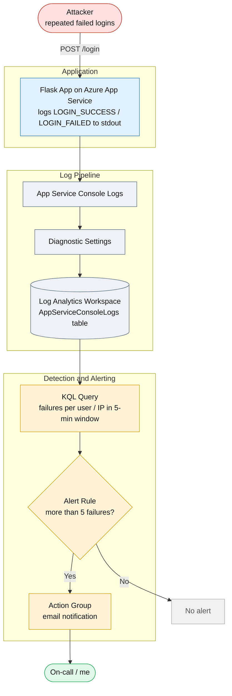

# CST8919 Lab 2 - Web App Threat Detection with Azure Monitor & KQL

A Python Flask app deployed to Azure App Service that logs login attempts.
Logs are shipped to a Log Analytics workspace via Diagnostic Settings, queried
with Kusto Query Language (KQL), and wired to an Azure Monitor alert that emails
me when brute-force behaviour is detected.

## Demo video

YouTube: https://youtu.be/wPwwWF6wd1E?si=iWzcC9C5Icj_J79J

## Architecture


## Endpoints

| Method | Route     | Purpose                                  |
|--------|-----------|------------------------------------------|
| GET    | `/`       | Health check                             |
| POST   | `/login`  | Logs `LOGIN_SUCCESS` / `LOGIN_FAILED`    |

The app logs every attempt in a consistent, parseable format
(`LOGIN_FAILED user=<name> ip=<addr>`) and reads the real client IP from the
`X-Forwarded-For` header, since App Service sits behind a reverse proxy.

## How to test

Use `test-app.http` (VS Code REST Client) or this loop to generate volume:

```powershell
$APP = "https://<your-app-name>.azurewebsites.net"
1..15 | ForEach-Object {
  try { Invoke-RestMethod -Uri "$APP/login" -Method Post -ContentType "application/json" -Body '{"username":"admin","password":"wrong"}' } catch {}
}
```

## KQL queries

### 1. Alert query (used by the alert rule)

The Azure Monitor alert counts table rows on this filtered query and fires when
more than 5 failures land in a 5-minute window:

```kql
AppServiceConsoleLogs
| where ResultDescription has "LOGIN_FAILED."
```

`where` keeps only matching rows; `has` is a fast, indexed, case-insensitive
token match. The alert engine handles the counting (Measure: Table rows,
Threshold: > 5, Granularity: 5 min, Frequency: 1 min).

### 2. Enhanced detection query (real-world improvement)

This version does the detection itself - it parses each log line and counts
failures per user, per IP, per 5-minute window, flagging any window over the
threshold:

```kql
AppServiceConsoleLogs
| where ResultDescription has "LOGIN_FAILED"
| extend user = extract(@"user=(\w+)", 1, ResultDescription)
| extend ip   = extract(@"ip=([\d\.]+)", 1, ResultDescription)
| summarize FailedAttempts = count() by user, ip, bin(TimeGenerated, 5m)
| where FailedAttempts > 5
| order by FailedAttempts desc
```

`extract()` pulls the `user` and `ip` out of the raw log string using regex
capture groups (this is the payoff for the structured `key=value` log format).
`summarize ... by bin(TimeGenerated, 5m)` buckets failures into 5-minute windows
and counts them per source. Counting failures *per source per window* - rather
than a raw total - is what distinguishes a real brute-force signature from
ordinary users mistyping their passwords.

## Alert rule

- Scope: Log Analytics workspace
- Condition: alert query above
- Measure: Table rows · Threshold: > 5 · Granularity: 5 min · Eval freq: 1 min
- Action group: email notification
- Severity: 3
- Result: fired correctly and delivered an email on a simulated brute-force burst.

## What I learned

- How a telemetry pipeline works end to end: app stdout is captured as
  `AppServiceConsoleLogs`, forwarded by a Diagnostic Setting into a Log
  Analytics workspace, and becomes queryable rows.
- The `AppServiceConsoleLogs` schema and how to query it with KQL.
- Parsing unstructured log text with `extract()` and regex, and time-windowed
  aggregation with `summarize` + `bin()`.
- Turning a KQL query into an automated Azure Monitor alert with an action group.
- Why structured logging matters - logging `user=… ip=…` in a fixed shape made
  the KQL trivial; a free-form message would have been painful to parse.
- Reading the real client IP from `X-Forwarded-For` behind App Service's proxy.

## Challenges I faced

- Python `venv` creation failed on the `ensurepip` step on Windows; fixed by
  creating the environment with `--without-pip` and bootstrapping pip manually.
- PowerShell's `Invoke-RestMethod` reports a 401 as a red error, which looked
  like a failure but was actually the app correctly rejecting bad credentials.
- The first batch of logs took a few minutes to appear in the workspace, so the
  table looked empty at first - a timing issue, not a misconfiguration.
- The alert fired twice in consecutive minutes for a single incident, because a
  1-minute evaluation frequency re-checks the same 5-minute window repeatedly.

## How I'd improve detection in a real-world scenario

- Log structured JSON and parse with `parse_json()` instead of regex on strings -
  far more robust to format drift.
- Group by source IP (not just username) to catch credential-stuffing and
  distributed attacks that spray many usernames from one address.
- Reduce false positives: exclude known-good office IPs, and only alert when there
  is no successful login after N failures.
- Reduce alert noise: tune the evaluation frequency and enable auto-resolve, since
  I observed the rule fire twice for one incident.
- Add account lockout at the app layer - detection reports an attack; lockout
  actually stops it.

